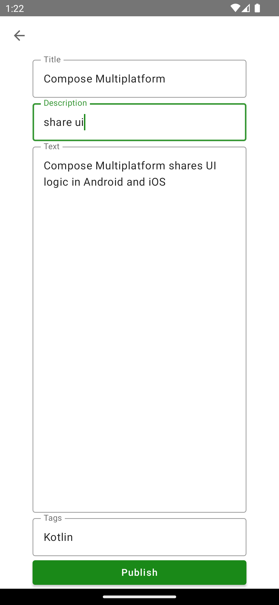

# 

> ### Kotlin Multiplatform codebase containing real world examples (CRUD, auth, advanced patterns, etc) that adheres to the [RealWorld](https://github.com/gothinkster/realworld) spec and API.

### [Demo](https://demo.realworld.io/)&nbsp;&nbsp;&nbsp;&nbsp;[RealWorld](https://github.com/gothinkster/realworld)

This codebase was created to demonstrate a fully fledged fullstack application built with Kotlin
Multiplatform including CRUD operations, authentication, routing, pagination, and more.

We've gone to great lengths to adhere to the Kotlin Multiplatform community styleguides & best
practices.

For more information on how to this works with other frontends/backends, head over to
the [RealWorld](https://github.com/gothinkster/realworld) repo.

# How it works

This is a Kotlin Multiplatform project targeting Android and iOS.

The logic and UI is shared between iOS and Android and is implemented in the composeApp module.

Following libraries are used: 
- [Ktor](https://ktor.io/) for networking
- [Kotlin Serialization](https://kotlinlang.org/docs/serialization.html) for JSON parsing
- [Koin](https://insert-koin.io/) for dependency injection
- [Multiplatform Paging](https://github.com/cashapp/multiplatform-paging) for pagination
- [Voyager](https://github.com/adrielcafe/voyager) for navigation and screen state handling
- [Kamel](https://github.com/Kamel-Media/Kamel) for image loading

# Getting started

1. Set up your environment for Kotlin Multiplaform according to
   the [documentation](https://www.jetbrains.com/help/kotlin-multiplatform-dev/multiplatform-setup.html)
2. Run either the Android app (composeApp) or the iOS app (iosApp) in Android
   Studio. 

# Android vs

| Screen         | Android                               | iOS                               |
|----------------|---------------------------------------|-----------------------------------|
| Article List   |            |            |
| Signup         |          |          |
| Create Article |  |  |
| User Profile   |         |        |